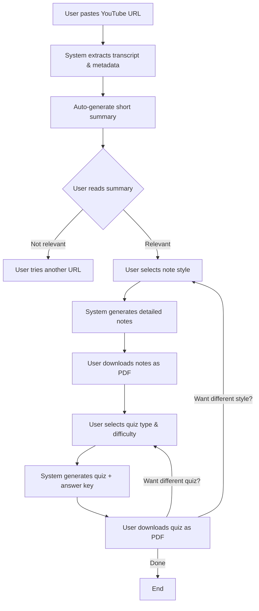
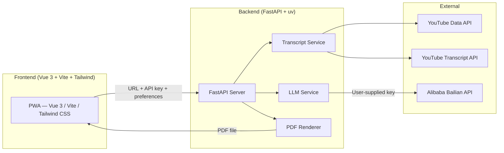

# NoteStream — Product Requirements Document

> **Version:** 1.0 · **Date:** 2026-02-19 · **Status:** Draft

---

## 1. Overview

**NoteStream** is a web application that transforms any YouTube tutorial into structured, downloadable study materials. Given a YouTube URL, it:

1. **Summarises** the video so users can quickly judge relevance and understand overall structure.
2. **Generates detailed notes** in the user's chosen style, enriched with tables, diagrams, glossaries, examples, and more.
3. **Creates quizzes** at configurable difficulty, downloadable as PDFs with full answer keys.

The goal is to eliminate the friction between *watching a tutorial* and *having usable study materials*, saving learners hours of manual note-taking.

---

## 2. Target Users

| Persona                          | Description                                                                                                  |
| -------------------------------- | ------------------------------------------------------------------------------------------------------------ |
| **Self-directed learner**  | Watches YouTube tutorials to pick up new skills (coding, design, languages). Wants concise, revisable notes. |
| **Exam student**           | Preparing for IELTS / AP / IB / A-Level etc. Needs structured revision notes and practice questions.         |
| **Professional upskiller** | Limited time; needs to judge video relevance fast, then extract actionable knowledge.                        |
| **Educator / Tutor**       | Wants to generate worksheets, flashcards, or crosswords from a video to share with students.                 |

---

## 3. User Flow



---

## 4. Feature Specifications

### 4.1 YouTube URL Input & Processing

| Aspect                          | Detail                                                                                                                                                                                         |
| ------------------------------- | ---------------------------------------------------------------------------------------------------------------------------------------------------------------------------------------------- |
| **Input**                 | A single YouTube video URL (standard or shortened format).                                                                                                                                     |
| **API Key**               | User provides their own Alibaba Bailian API key at session start. The key is used for all LLM calls (Default model: `qwen3.5-plus`) and is **not** stored persistently.                                            |
| **Validation**            | Reject non-YouTube URLs, private/unavailable videos. If the video has no captions/transcript, display a clear message: *"This video has no available captions. Please try a different video."* |
| **Transcript extraction** | Use YouTube's auto-generated or manually uploaded captions. Support English as the primary language; future i18n is out of scope for v1. **No Whisper fallback — caption-only.**               |
| **Metadata extraction**   | Title, channel name, duration, publish date, thumbnail, description.                                                                                                                           |

### 4.2 Video Summary (Auto-generated)

The summary is displayed **immediately** after URL processing. Its purpose is *decision support* — helping the user decide whether the video is worth studying in depth.

| Aspect            | Detail                                                                                                                                            |
| ----------------- | ------------------------------------------------------------------------------------------------------------------------------------------------- |
| **Length**  | 150–300 words.                                                                                                                                   |
| **Content** | High-level structure of the video: what major topics are covered, in what order, and the overall teaching approach.**No granular details.** |
| **Tone**    | Neutral, informative, third-person.                                                                                                               |
| **Display** | Shown inline on the page — not a downloadable artifact by itself (though it appears at the top of all note PDFs for context).                    |

### 4.3 Note Generation

After reading the summary, the user selects a note style. Notes must be **comprehensive** — no relevant point from the video should be omitted.

#### 4.3.1 Note Styles

| Style                  | Description                                                                                                                                                                                       |
| ---------------------- | ------------------------------------------------------------------------------------------------------------------------------------------------------------------------------------------------- |
| **Cornell**      | Two-column layout:*cue column* (keywords/questions) on the left, *note-taking column* (detailed explanations) on the right. A *summary section* at the bottom of each page.                 |
| **Mind Map**     | Radial/tree diagram with the central topic in the middle, branching into sub-topics and details. Visual, non-linear.                                                                              |
| **Hierarchical** | Traditional outline: numbered headings (1, 1.1, 1.1.1 …) with nested bullet points. Clean, scannable, textbook-like.                                                                             |
| **Custom**       | A free-text input where the user describes their preferred format (e.g. "Zettelkasten-style atomic notes" or "Q&A pairs"). The system interprets the description and generates notes accordingly. |

#### 4.3.2 Note Content Requirements

Every set of generated notes — regardless of style — **must** include the following elements *where relevant to the topic*:

| Element                         | Rule                                                                                                                                                                                                        |
| ------------------------------- | ----------------------------------------------------------------------------------------------------------------------------------------------------------------------------------------------------------- |
| **Comparison tables**     | When the video compares ≥ 2 concepts, methods, or tools.                                                                                                                                                   |
| **Charts / Diagrams**     | Generated programmatically (e.g. flowcharts, bar charts) or extracted directly from the video frames when a visual is shown on-screen.                                                                      |
| **Vocabulary / Glossary** | Any technical term or jargon used in the video, with concise definitions. Placed as a dedicated section.                                                                                                    |
| **Timelines**             | When the video covers historical events, step-by-step processes, or sequential workflows.                                                                                                                   |
| **Examples**              | All examples demonstrated in the video, faithfully reproduced.**If the video lacks examples for a concept, the system must generate appropriate ones and clearly label them as "Generated Example".** |
| **Key formulas / code**   | When applicable (math, programming, science tutorials).                                                                                                                                                     |

#### 4.3.3 PDF Download

- Notes are rendered into a well-formatted, aesthetic, print-ready **PDF**.
- Each PDF includes a header with the video title, channel, URL, and generation date.
- The summary from §4.2 appears on the first page as context.
- Mind maps are rendered as a visual graphic (SVG/PNG embedded in the PDF), not as indented text.
- Users may generate and download notes in **any style, any number of times**, for the same video. There is no limit.

### 4.4 Quiz Generation

After notes, the user optionally selects a quiz type and difficulty.

#### 4.4.1 Quiz Types

| Type                      | Description                                                                                                                                                                                                                            |
| ------------------------- | -------------------------------------------------------------------------------------------------------------------------------------------------------------------------------------------------------------------------------------- |
| **None**            | User skips quiz generation.                                                                                                                                                                                                            |
| **Flashcards**      | Front: question or term. Back: answer or definition. Rendered as individual cards in the PDF (e.g. 4 per page, with a cut-line guide).                                                                                                 |
| **Multiple Choice** | 4 options per question, one correct. Explanations for all options in the answer key.                                                                                                                                                   |
| **Written Answers** | Open-ended questions expecting short-paragraph responses. Mark scheme with model answer and marking criteria included.                                                                                                                 |
| **Exam Style**      | When the user selects this type, they must specify which exam (e.g. IELTS Writing Task 2, AP Biology, IB History Paper 2, A-Level Maths). The system then searches for the corresponding **official syllabus, assessment criteria, and marking rubrics** to model questions after real exam formats. Includes realistic question formatting, time guidance, and examiner-style mark schemes aligned to the specified exam board. |
| **Crossword**       | A crossword puzzle where the clues are definitions and the answers are vocabulary from the video. Solution grid provided separately.                                                                                                   |
| **Custom**          | User describes their desired quiz format in free text (e.g. "fill-in-the-blank sentences" or "diagram labelling").                                                                                                                     |

#### 4.4.2 Difficulty Levels

| Level            | Scope                                                                                                                                                  |
| ---------------- | ------------------------------------------------------------------------------------------------------------------------------------------------------ |
| **Easy**   | Tests only foundational / introductory concepts from the video. Suitable for first-pass review.                                                        |
| **Medium** | Covers all concepts presented in the video — a comprehensive check.                                                                                   |
| **Hard**   | Requires applying knowledge flexibly: inference, transfer to new contexts, multi-step problem solving. Goes slightly beyond what was explicitly shown. |

#### 4.4.3 Quiz PDF Download

- Each quiz PDF contains: the quiz itself, and a separate **Answer Key / Mark Scheme** section (starting on a new page so they can be printed independently).
- Crossword PDFs include: the empty grid + numbered clue list, and a filled solution grid on a separate page.
- Users may generate and download quizzes in **any type and difficulty, any number of times**, for the same video. There is no limit.

---

## 5. Non-Functional Requirements

| Category                 | Requirement                                                                                                             |
| ------------------------ | ----------------------------------------------------------------------------------------------------------------------- |
| **Performance**    | Summary generation should complete within 15 seconds for a 30-minute video. Note and quiz generation within 30 seconds. |
| **Scalability**    | System should handle concurrent users without degradation; use async processing and job queues.                         |
| **Reliability**    | Gracefully handle YouTube API rate limits, unavailable videos, and LLM failures with user-facing error messages.        |
| **Accessibility**  | PDFs must be text-selectable (not image-only). Web UI must meet WCAG 2.1 AA.                                            |
| **Security**       | No user-generated content is stored permanently. User-supplied API keys are held in memory for the session only, never persisted to disk or database. All LLM calls use HTTPS. |
| **Responsiveness** | Web UI must be fully functional on desktop and mobile browsers.                                                         |

---

## 6. Technical Architecture (High-Level)

Follows the **fullstack-pwa-dev** stack: shared Python core, FastAPI backend, Vue 3 + Vite + Tailwind PWA frontend.



### Stack Details

| Layer              | Technology                                                                      |
| ------------------ | ------------------------------------------------------------------------------- |
| **Package mgmt**   | `uv` (Python), `npm` (frontend)                                                |
| **Data models**    | `Pydantic` — shared across API request/response and internal services           |
| **Backend**        | `FastAPI` + `uvicorn`, async endpoints                                          |
| **LLM provider**   | Alibaba Bailian (`bailian.console.aliyun.com`) — user provides their own API key per session. Default model: `qwen3.5-plus`.                       |
| **Transcript**     | `youtube-transcript-api` (captions), YouTube Data API v3 (metadata)             |
| **PDF rendering**  | WeasyPrint or Puppeteer — converts Markdown/JSON → styled PDF                   |
| **Frontend**       | Vue 3 (Composition API) + Vite + Tailwind CSS + Vite PWA Plugin                |
| **Database**       | Turso (LibSQL) — optional, for caching transcripts/generated content            |
| **Deployment**     | Frontend → Vercel/Netlify (static + Serverless Functions), Backend → Vercel Serverless or Render |

---

## 7. Scope & Constraints

### In Scope (v1)

- Single YouTube URL processing.
- English-language transcripts.
- Four note styles (Cornell, Mind Map, Hierarchical, Custom).
- Six quiz types (Flashcards, MCQ, Written, Exam-style, Crossword, Custom) + None + three difficulty levels.
- PDF download for notes and quizzes.
- Unlimited re-generation with different styles.

### Out of Scope (v1)

- Batch processing of multiple URLs.
- Non-YouTube video sources (Vimeo, Coursera, local files).
- User accounts, history, or saved sessions.
- Real-time collaborative note editing.
- Multi-language transcript support.
- Mobile native apps.

---

## 8. Success Metrics

| Metric                              | Target                                                                                                |
| ----------------------------------- | ----------------------------------------------------------------------------------------------------- |
| **Summary accuracy**          | ≥ 90% of users agree the summary correctly represents the video (surveyed).                          |
| **Note completeness**         | ≥ 95% of key points from the transcript appear in generated notes (audited on sample videos).        |
| **Quiz quality**              | ≥ 85% of generated questions are pedagogically valid (no ambiguous answers, appropriate difficulty). |
| **PDF download success rate** | ≥ 99% of generation attempts result in a valid, downloadable PDF.                                    |
| **Time to first summary**     | P95 ≤ 15 seconds for videos ≤ 60 minutes.                                                           |

---

## 9. Resolved Decisions

| # | Question                                        | Decision                                                                                                                                                     |
| - | ----------------------------------------------- | ------------------------------------------------------------------------------------------------------------------------------------------------------------ |
| 1 | LLM provider                                    | **Alibaba Bailian**. User inputs their own API key each session. Default model: `qwen3.5-plus`.                                                                 |
| 2 | Videos without captions                          | **Not supported.** Display a friendly error message and prompt the user to try a different video.                                                            |
| 3 | Exam Style quiz — how to determine the exam?     | **User specifies the exam** (e.g. "IELTS Writing Task 2"). The model then searches for the official syllabus / assessment criteria / marking rubric to align question format and mark schemes to the real exam. |
| 4 | Caching generated content                        | **Yes — use Turso (LibSQL)** to cache transcripts and generated content per video. Avoids redundant LLM calls; cache invalidation TBD.                       |
| 5 | Tech stack & deployment                          | **fullstack-pwa-dev** stack: FastAPI backend + Vue 3 / Vite / Tailwind PWA frontend. Deployed to Vercel/Netlify (frontend) and Vercel Serverless or Render (backend). See §6 for full stack details. |

---

## 10. LLM Prompt Templates

These are the system-level prompt instructions passed to the LLM for each style. All prompts share the same inputs:

- `{{transcript}}` — full cleaned transcript of the video
- `{{title}}` — video title
- `{{channel}}` — channel name
- `{{difficulty}}` — `easy` | `medium` | `hard` (quiz prompts only)
- `{{custom_style_description}}` — free-text from user (Custom note/quiz only)
- `{{exam_name}}` — exam specified by user (Exam Style only)

---

### 10.1 Note Style Prompts

#### Cornell Notes

```
You are an expert study notes creator. Generate comprehensive Cornell-style notes from the transcript below.

Layout rules:
- Divide content into logical topic sections.
- For each section, produce TWO columns:
    LEFT — Cue Column: concise keywords, short questions, or memory triggers (1–6 words each) that prompt recall of the right-column content.
    RIGHT — Note-Taking Column: detailed explanations, facts, definitions, and information corresponding to each left-column cue.
- At the bottom of each section, add a Summary block (2–4 sentences) synthesising the key takeaways.

Content requirements (apply regardless of topic):
- Vocabulary / Glossary: a dedicated end-section listing every technical term with a concise definition.
- Comparison tables: whenever the video contrasts ≥ 2 concepts, methods, or tools.
- Timelines / step lists: for any historical sequence, process, or workflow.
- Examples: reproduce ALL examples from the transcript exactly. For any concept that lacks an example, generate one and label it [Generated Example].
- Formulas / code: include verbatim, formatted in a code block.
- Completeness: do NOT omit any concept, fact, or point from the video.

Output: Structured Markdown (##/### headers, bold cues, tables where needed).

Video title: {{title}} | Channel: {{channel}}
Transcript: {{transcript}}
```

---

#### Mind Map

```
You are an expert study notes creator. Generate a comprehensive mind map in nested Markdown outline format (to be rendered as a visual radial diagram).

Structure:
- Central node: main topic of the video (from the title).
- Level 1 branches: major themes or sections (4–8 branches).
- Level 2 branches: key concepts, subtopics, or arguments under each theme.
- Level 3 branches (where needed): supporting details, examples, data points, definitions.
- Leaf nodes: concrete facts, formulas, examples, or memorable phrases.

Content requirements:
- Full coverage — no concept from the transcript may be omitted.
- Comparisons: show compared items as parallel sibling branches under a shared parent labelled "Comparison: [Topic]".
- Generated examples: suffix with (Generated Example).
- Key Terms: include as leaf nodes under a dedicated "Key Terms" branch with inline definitions.

Output: Nested Markdown list using indentation to show depth. Use ONLY list items (- item), no prose paragraphs.

Video title: {{title}} | Channel: {{channel}}
Transcript: {{transcript}}
```

---

#### Hierarchical (Outline) Notes

```
You are an expert study notes creator. Generate comprehensive hierarchical outline notes from the transcript below.

Structure:
1. Major Topic
   1.1 Sub-topic
      1.1.1 Supporting detail
         - Granular fact, example, or data point

Rules:
- Strict logical hierarchy: every idea sits under its parent concept.
- Vocabulary / Glossary: alphabetically sorted end-section with term definitions.
- Comparison tables: whenever ≥ 2 items are contrasted.
- Timelines / numbered step lists: for sequential processes or workflows.
- Examples: reproduce ALL transcript examples exactly; generate and label [Generated Example] for any concept without one.
- Formulas / code snippets / equations: include verbatim in code blocks.
- Completeness: the notes must be exhaustive — do not skip or summarise any topic.

Output: Structured Markdown with numbered headings and nested bullet points.

Video title: {{title}} | Channel: {{channel}}
Transcript: {{transcript}}
```

---

#### Custom Notes

```
You are an expert study notes creator. The user has requested their notes in the following custom style:

"{{custom_style_description}}"

Use the style description above as your formatting and structural guide. Then generate comprehensive notes from the transcript below.

Non-negotiable content requirements (apply regardless of style):
- Cover EVERY concept, fact, and point from the transcript — nothing omitted.
- Vocabulary / Glossary: list all technical terms with definitions.
- Comparison tables: when ≥ 2 concepts are contrasted.
- Timelines / step lists: for sequential processes.
- Examples: reproduce all transcript examples exactly; generate and label [Generated Example] where missing.
- Formulas / code: include verbatim in code blocks.

Output: use Markdown, structured according to the user's style description.

Video title: {{title}} | Channel: {{channel}}
Transcript: {{transcript}}
```

---

### 10.2 Quiz Style Prompts

#### Flashcards

```
You are an expert quiz creator. Generate a set of flashcards testing knowledge of the video below.

Each flashcard:
  FRONT: A concise question OR a vocabulary term.
  BACK: The answer, definition, or explanation (2–5 sentences max).

Difficulty rules (current difficulty: {{difficulty}}):
  easy   → cover only the core introductory concepts (top ~30% most essential ideas).
  medium → cover all concepts from the video comprehensively.
  hard   → include scenario-based or application questions requiring knowledge transfer, not just recall.

Additional rules:
- At least one flashcard per distinct concept.
- Vocabulary / definition flashcards for every technical term.
- No duplicate questions.

Output format (Markdown):

**Card [N]**
FRONT: [question or term]
BACK: [answer or definition]

Video title: {{title}} | Channel: {{channel}}
Transcript: {{transcript}}
```

---

#### Multiple Choice

```
You are an expert quiz creator. Generate a multiple-choice quiz from the transcript below.

Each question:
- Clear, unambiguous question stem.
- Exactly 4 options labelled A, B, C, D.
- Exactly one correct answer.
- Plausible distractors reflecting common misconceptions.

Difficulty rules (current difficulty: {{difficulty}}):
  easy   → test recall of foundational/introductory concepts only.
  medium → test all concepts from the video comprehensively.
  hard   → questions requiring reasoning, inference, or application in unfamiliar contexts — not mere recall.

Output format (Markdown):

Quiz section:
[N]. [Question stem]
A) ...   B) ...   C) ...   D) ...

Answer Key section (new page):
[N]. Correct: [Letter] — [Explanation]. Distractors: A) [why wrong] B) [why wrong] … (skip correct option).

Video title: {{title}} | Channel: {{channel}}
Transcript: {{transcript}}
```

---

#### Written Answers

```
You are an expert quiz creator. Generate an open-ended written-answer quiz from the transcript below.

Each question should:
- Require a short paragraph response (2–6 sentences for easy/medium; 1–3 paragraphs for hard).
- Test understanding, not verbatim recall.
- Be answerable using knowledge from the video alone.

Difficulty rules (current difficulty: {{difficulty}}):
  easy   → explain or define key concepts.
  medium → connect multiple ideas across the video; comprehensive coverage.
  hard   → analysis, evaluation, or application to novel scenarios (mini-essay level).

Output format (Markdown):

Quiz section: numbered question list.

Mark Scheme section (new page):
For each question —
  Model Answer: [well-written example response]
  Marking Criteria: bullet list of points the answer must include for full marks.

Video title: {{title}} | Channel: {{channel}}
Transcript: {{transcript}}
```

---

#### Exam Style

```
You are an expert exam paper creator. The student is preparing for: {{exam_name}}.

Step 1 — Research: Retrieve the official assessment objectives, question formats, mark allocation conventions, and marking rubrics for {{exam_name}}. Apply them strictly when writing questions.

Step 2 — Write a practice paper based on the transcript below:
- Mirror the structure and question types of real {{exam_name}} papers exactly (e.g. short answer, data response, essay, source analysis — as applicable to this exam).
- Show marks per question in brackets, e.g. [4 marks].
- Include total marks and suggested time allocation at the top (per official exam conventions).
- Content must come from the transcript, assessed at the level/style of {{exam_name}}.

Difficulty (current: {{difficulty}}):
  easy   → foundational recall questions.
  medium → all topics; standard exam difficulty.
  hard   → higher-order questions requiring flexible application and evaluation.

Output format (Markdown, formatted as a real exam paper):

Exam paper section.

Mark Scheme section (new page): examiner-style mark scheme per question — key marking points, acceptable phrasings, and band descriptors for extended responses.

Video title: {{title}} | Channel: {{channel}}
Transcript: {{transcript}}
```

---

#### Crossword

```
You are an expert puzzle designer. Generate a crossword puzzle testing vocabulary from the transcript below.

Steps:
1. Extract ≥15 key terms, names, and technical vocabulary from the transcript.
2. Write a precise clue (1–2 sentences) for each term.
3. Arrange terms into a valid crossword grid:
   - Define ACROSS and DOWN entries with grid coordinates (row, col of first letter).
   - All intersecting letters must match.
   - No isolated (unconnected) words.

Output format (Markdown):

Puzzle section:
  ACROSS — [N]. [Clue] ([letter count])
  DOWN   — [N]. [Clue] ([letter count])
  ASCII grid: # = black square, _ = empty letter cell, show start numbers.

Solution section (new page):
  Filled ASCII grid.
  Answer list: ACROSS [N]: ANSWER, DOWN [N]: ANSWER.

Video title: {{title}} | Channel: {{channel}}
Transcript: {{transcript}}
```

---

#### Custom Quiz

```
You are an expert quiz creator. The user wants a quiz in the following custom format:

"{{custom_quiz_description}}"

Use the format description above as your structural and formatting guide. Generate a quiz from the transcript below.

Non-negotiable rules:
  easy   → test only foundational/introductory concepts.
  medium → test all concepts from the video comprehensively.
  hard   → require flexible application, inference, or knowledge transfer to new situations.
  Current difficulty: {{difficulty}}

- Every question must be unambiguously answerable from the video (or general knowledge for hard).
- Include a separate Answer Key / Mark Scheme section (new page) with correct answers and brief explanations.

Output: Markdown, structured per the user's format description.

Video title: {{title}} | Channel: {{channel}}
Transcript: {{transcript}}
```
